---
title       : Data Visualization
subtitle    : "Lecture 3: Taste of R Workshop, UO COE"
author      : Daniel Anderson
framework   : io2012        # {io2012, html5slides, shower, dzslides, ...}
highlighter : highlight.js  # {highlight.js, prettify, highlight}
hitheme     : zenburn      # 
widgets     : [mathjax]            # {mathjax, quiz, bootstrap}
mode        : selfcontained # {standalone, draft}
knit        : slidify::knit2slides
--- 
<style>
em {
  font-style: italic
}
</style>

<style>
strong {
  font-weight: bold;
}
</style>


## Agenda
* Review of tidy data
* Introduce the *ggplot2* package
* Model-based plotting and an advanced example with  *purrr*  (time permitting)

**Note:** There is a *lot* that we won't cover (title and labels, for example). This is meant to be a broad overview. Get in contact with me if you want to know more (I have other slides). 


---- 
## Tidy data

# Definition
1. Each variable is a column
2. Each observation is a row
3. Each type of observational unit forms a table

<div align = "left">

</div>

----
## Quick example (review)


|religion                | <$10k| $10-20k| $20-30k| $30-40k| $40-50k| $50-75k| $75-100k| $100-150k| >150k| Don't know/refused|
|:-----------------------|-----:|-------:|-------:|-------:|-------:|-------:|--------:|---------:|-----:|------------------:|
|Agnostic                |    27|      34|      60|      81|      76|     137|      122|       109|    84|                 96|
|Atheist                 |    12|      27|      37|      52|      35|      70|       73|        59|    74|                 76|
|Buddhist                |    27|      21|      30|      34|      33|      58|       62|        39|    53|                 54|
|Catholic                |   418|     617|     732|     670|     638|    1116|      949|       792|   633|               1489|
|Don’t know/refused      |    15|      14|      15|      11|      10|      35|       21|        17|    18|                116|
|Evangelical Prot        |   575|     869|    1064|     982|     881|    1486|      949|       723|   414|               1529|
|Hindu                   |     1|       9|       7|       9|      11|      34|       47|        48|    54|                 37|
|Historically Black Prot |   228|     244|     236|     238|     197|     223|      131|        81|    78|                339|
|Jehovah's Witness       |    20|      27|      24|      24|      21|      30|       15|        11|     6|                 37|
|Jewish                  |    19|      19|      25|      25|      30|      95|       69|        87|   151|                162|
|Mainline Prot           |   289|     495|     619|     655|     651|    1107|      939|       753|   634|               1328|
|Mormon                  |    29|      40|      48|      51|      56|     112|       85|        49|    42|                 69|
|Muslim                  |     6|       7|       9|      10|       9|      23|       16|         8|     6|                 22|
|Orthodox                |    13|      17|      23|      32|      32|      47|       38|        42|    46|                 73|
|Other Christian         |     9|       7|      11|      13|      13|      14|       18|        14|    12|                 18|
|Other Faiths            |    20|      33|      40|      46|      49|      63|       46|        40|    41|                 71|
|Other World Religions   |     5|       2|       3|       4|       2|       7|        3|         4|     4|                  8|
|Unaffiliated            |   217|     299|     374|     365|     341|     528|      407|       321|   258|                597|

----
## The tidied version


|religion |income             | freq|
|:--------|:------------------|----:|
|Agnostic |<$10k              |   27|
|Agnostic |$10-20k            |   34|
|Agnostic |$20-30k            |   60|
|Agnostic |$30-40k            |   81|
|Agnostic |$40-50k            |   76|
|Agnostic |$50-75k            |  137|
|Agnostic |$75-100k           |  122|
|Agnostic |$100-150k          |  109|
|Agnostic |>150k              |   84|
|Agnostic |Don't know/refused |   96|
|Atheist  |<$10k              |   12|
|Atheist  |$10-20k            |   27|

----
## Why are we reviewing this?
* The *ggplot2* package can work with data in a variety of formats. However, it is *optimal* to work with a tidy data frame.

* Tidy data work best because it allows for simple definitions of group aesthetics, and faceting (both of which we'll talk about shortly).

* Having your data in a tidy format can reduce the amount of code you need to write to get the same plot, and can make your code more clear.

---- .segue
# ggplot2

----
## The *ggplot2* package
Today, we'll primarily be covering the basics of the *ggplot2* package. Much of this presentation is based on examples from the new *ggplot2* book.


----
## Part of the many reasons Hadley is a cool guy

<div align = "left">

</div>

(It's no longer there, but if you want access to it let me know)


----
## Other resources
The *ggplot2* package is one of the most popular R packages. There are a plethora of resources to learn the syntax. 

* Perhaps the most definitive, and indexes all the capabilities of ggplot2, along with multiple examples 
	+ http://docs.ggplot2.org/current/index.html#

* RStudio cheat sheet can also be helpful
	+ https://www.rstudio.com/wp-content/uploads/2015/03/ggplot2-cheatsheet.pdf


---- 
## Components
Every *ggplot* plot has three components

1. data
	* The data used to produce the plot
2. aesthetic mappings
	* between variables and visual properties
3. layer(s)
	* usually through the geom function to produce geometric shape to be rendered


----
## Basic syntax


Note that Hadley recommends putting each `geom_XXX` on a separate line to ease clarity. I agree with this suggestion, but will not be following it in these slides to help save space.

----
## mpg data
Very similar to the *mtcars* data, but with more cases and a few more interesting variables


```r
library(ggplot2)
data(mpg)
head(mpg)
```

```
## # A tibble: 6 × 11
##   manufacturer model displ  year   cyl      trans   drv   cty   hwy    fl
##          <chr> <chr> <dbl> <int> <int>      <chr> <chr> <int> <int> <chr>
## 1         audi    a4   1.8  1999     4   auto(l5)     f    18    29     p
## 2         audi    a4   1.8  1999     4 manual(m5)     f    21    29     p
## 3         audi    a4   2.0  2008     4 manual(m6)     f    20    31     p
## 4         audi    a4   2.0  2008     4   auto(av)     f    21    30     p
## 5         audi    a4   2.8  1999     6   auto(l5)     f    16    26     p
## 6         audi    a4   2.8  1999     6 manual(m5)     f    18    26     p
## # ... with 1 more variables: class <chr>
```

----
## Quick example


```r
data(mpg)
ggplot(mpg, aes(x = displ, y = hwy)) + geom_point()
```


----
## Quick example 2
Note that the only thing that has changed here is the `geom` 


```r
data(mpg)
ggplot(mpg, aes(x = displ, y = hwy)) + geom_smooth()
```


----
## Add an additional layer


```r
ggplot(mpg, aes(x = displ, y = hwy)) + geom_point() + geom_smooth()
```


----
## Add an additional aesthetic


```r
ggplot(mpg, aes(x = displ, y = hwy, color = class)) + geom_point() 
```


----
## Add smooth line for each class
# Too busy
Note the below spits out some warnings because of the sparsity of the data. I've suppressed them here.


```r
ggplot(mpg, aes(x = displ, y = hwy, color = class)) + geom_point() +
 geom_smooth()
```
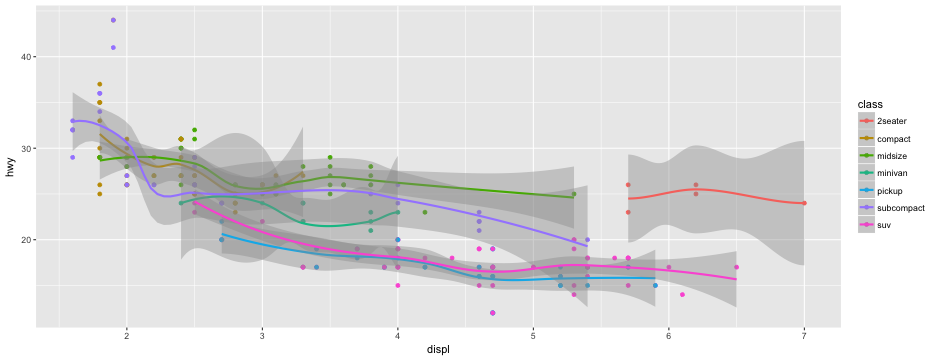

----
## Remove SE


```r
ggplot(mpg, aes(x = displ, y = hwy, color = class)) + geom_point() +
 geom_smooth(se = FALSE)
```


----
## Change the color of all points


```r
ggplot(mpg, aes(x = displ, y = hwy)) + geom_point(color = "purple") +
 geom_smooth(se = FALSE)
```

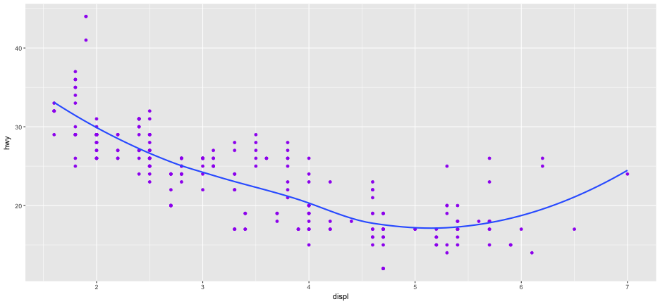

---- .segue
# Can you guess how we would change the line color?

----


```r
ggplot(mpg, aes(x = displ, y = hwy)) + geom_point(color = "purple") +
 geom_smooth(se = FALSE, color = "gray", size = 2, linetype = "dashed")
```


----
Worth mentioning, traditional calls to line color/type/size also work


```r
ggplot(mpg, aes(x = displ, y = hwy)) + geom_point(color = "purple") +
 geom_smooth(se = FALSE, col = "gray", lwd = 2, lty = "dashed")
```


----
## Change the "wiggliness" of the smoother


```r
ggplot(mpg, aes(x = displ, y = hwy)) + geom_point(color = "purple") +
 geom_smooth(span = 0.2)
```


----
## Geoms for two continuous variables


|Geoms     |Description                                                              |Code             |
|:---------|:------------------------------------------------------------------------|:----------------|
|jitter    |Jitter points (to avoid overlapping)                                     |geom_jitter()    |
|point     |Plot points at each x&#124;y intersection                                |geom_point()     |
|quantile  |Plot lines from quantile regression                                      |geom_quantile()  |
|rug       |Plot 1d scatterplot on margins (stripchart)                              |geom_rug()       |
|smooth    |Plot a smoothing function (many smoothers available)                     |geom_smooth()    |
|text      |Add text annotations                                                     |geom_text()      |
|bin2d     |Bin observations that are close together and color according the density |geom_bin2d()     |
|density2d |Contour lines of the data density                                        |geom_density2d() |
|hex       |Hexagonal bins of data colored according to their density                |geom_hex()       |

----
## Guided practice
* Load (install first, if necessary) the *ggplot2* package. 
* Load the diamonds dataset with `data(diamonds)`
* Set and store the data and aesthetics, in an object `p`, using the following code


```r
data(diamonds)
p <- ggplot(diamonds, aes(carat, price))
```
* Print `p`. What do you see?
* Explore different geoms, with `p + geom_XXX()`. For example, a basic scatterplot could be produced with


```r
p + geom_point()
```

* Add at least one additional layer (i.e., produce a plot with at least two layers)


-----
## Some possibilities


```r
p + geom_point()
```


----
## Probably better


```r
p + geom_hex()
```


----
## Another similar alternative

```r
p + geom_bin2d()
```


----
## Yet another alternative


```r
p + geom_point(alpha = 0.01) + geom_density2d(color = "red")
```


-----
## Quantiles
Defaults to the 25th, 50th, and 75th percentiles
 

```r
p + geom_quantile()
```


-----
## Quantiles
Change the quantiles to deciles (from 10th to 90th)


```r
p + geom_quantile(quantiles = seq(0.1, 0.9, 0.1))
```


----
## Add an extra layer


```r
p + geom_point() + geom_rug() + geom_smooth()
```

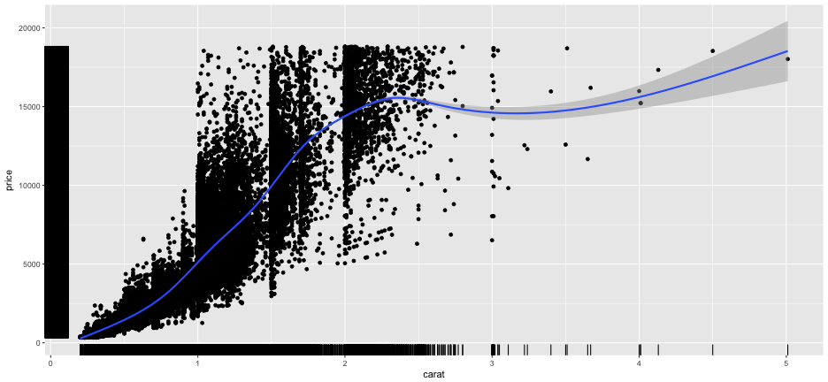

----
## Color by cut


```r
p2cut <- ggplot(diamonds, aes(carat, price, color = cut))
p2cut + geom_point()
```

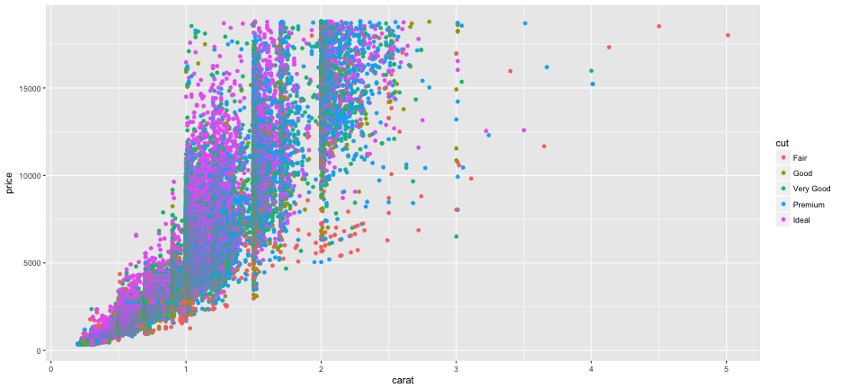

----
## Color by color


```r
p2color <- ggplot(diamonds, aes(carat, price, color = color))
p2color + geom_point()
```


----
## Color by clarity


```r
p2clarity <- ggplot(diamonds, aes(carat, price, color = clarity))
p2clarity + geom_point()
```

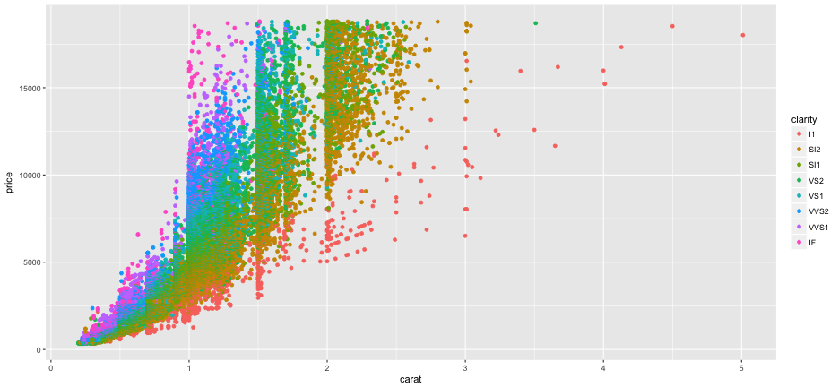

----
## geoms: One variable


|Geoms                  |Description                                                |Code                    |
|:----------------------|:----------------------------------------------------------|:-----------------------|
|area                   |Filled area plot                                           |geom_area(stat = "bin") |
|density                |Density plot                                               |geom_density()          |
|dotplot                |Stacked dotplot, with each dot representing an observation |geom_dotplot()          |
|polygon of Frequencies |Polygon of frequencies                                     |geom_freqpoly           |
|histogram              |Standard histogram                                         |geom_histogram          |
|barplot                |Standard barchart                                          |geom_bar                |

----
## Area plot

```r
price <- ggplot(diamonds, aes(price)) 
price + geom_area(stat = "bin")
```

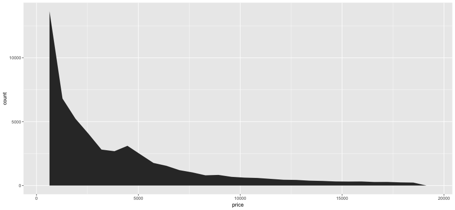

----
# Frequency polygons

```r
price + geom_freqpoly()
```

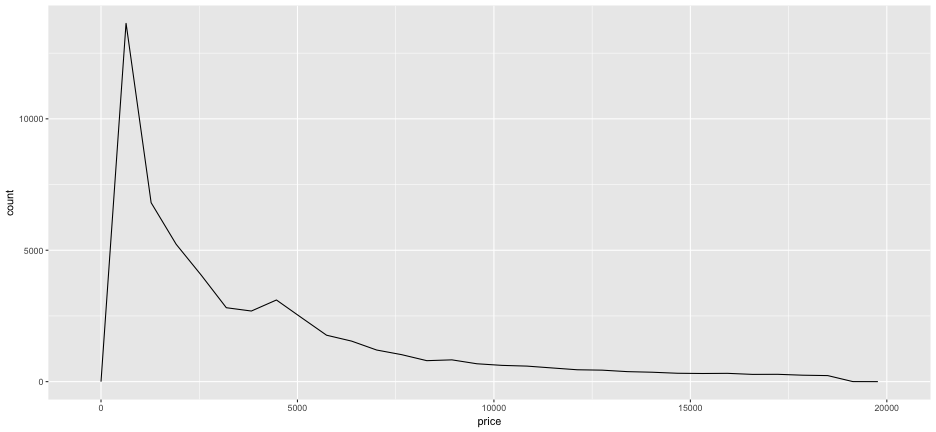

----
## Evaluate frequencies by *cut*


```r
price2 <- ggplot(diamonds, aes(price, color = cut))
price2 + geom_freqpoly(bins = 50)
```


----
## Histograms

```r
price + geom_histogram()
```


----
# Change binwidth

```r
price + geom_histogram(binwidth = 5)
```


----
## Barplots


```r
ggplot(mpg, aes(trans)) + geom_bar()
```


---- .segue
# Plotting categorical variables

----
## boxplots
Note that the categorical variable must be categorical or declared as a factor


```r
bp <- ggplot(mpg, aes(drv, hwy))
bp + geom_boxplot()
```


---- &twocol
## stripcharts

*** =left


```r
bp + geom_point()
```


*** =right


```r
bp + geom_jitter()
```


-----
## Control the amount of jittering


```r
bp + geom_jitter(width = 0.3)
```

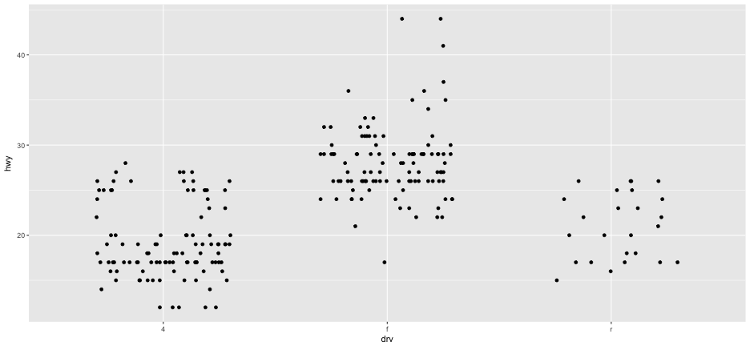

----
## Useful together


```r
bp + geom_boxplot() + geom_jitter(width = 0.3)
```

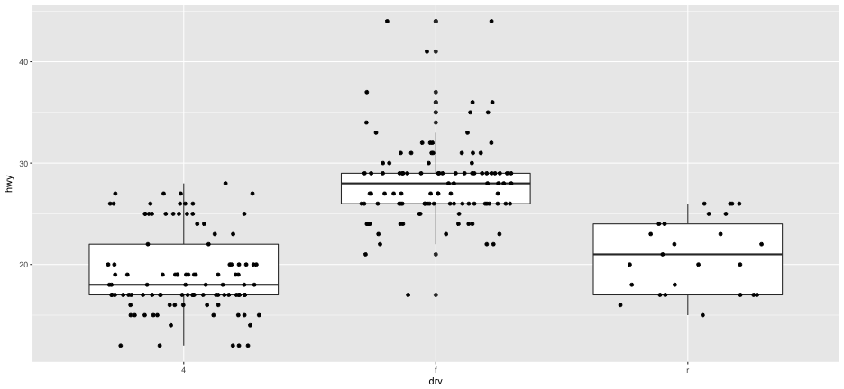

----
## Usually better: Violin plots


```r
bp + geom_violin()
```

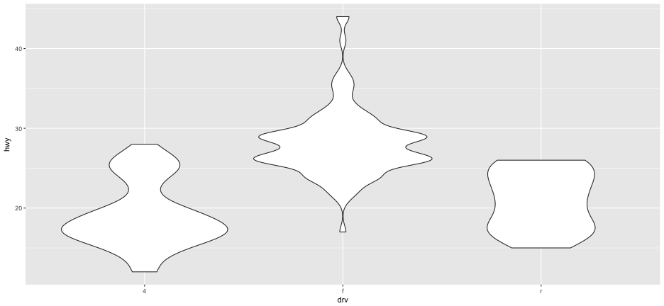

--- .segue
# Faceting

----
## Produce separate plots according to a specific variable
Back to the mpg dataset:
* Produce a separate plot of the relation between engine size and highway miles per gallon for each car type.


```r
hwy <- ggplot(mpg, aes(displ, hwy))
hwy + geom_point() + facet_wrap(~class)
```


----
## Add a linear function to each plot


```r
hwy <- ggplot(mpg, aes(displ, hwy))
hwy + geom_point() + geom_smooth(method = "lm") + facet_wrap(~class)
```


----
## Example with growth modeling
The data


```r
# Loaded earlier
head(d, n = 15)
```

```
##         SID   TID ScID    Months RIT
## 2873 332347 30867 1117 8.7387097 192
## 355  400047 69957 1077 1.6387097 182
## 387  400047 69957 1077 4.3225806 179
## 162  400047 69957 1077 8.9677419 191
## 648  400277 69957 1077 1.2053763 196
## 230  400277 69957 1077 4.3225806 197
## 780  400277 69957 1077 8.9677419 209
## 8878 400597 32247 1257 0.9720430 197
## 8914 400597 32247 1257 4.2258065 202
## 8790 400597 32247 1257 8.3053763 211
## 348  400807 28767 1077 1.3387097 178
## 168  400807 28767 1077 4.1935484 190
## 803  400807 28767 1077 8.8053763 178
## 1150 401227 32787 1087 0.9387097 187
## 1269 401227 32787 1087 4.1612903 192
```

----
## Random sampling
There are far too many students to plot every one. Instead, we'll take a random sample of 16 (a couple of times)


```r
set.seed(100)
samp1 <- d[d$SID %in% sample(levels(d$SID), 16), ]
samp2 <- d[d$SID %in% sample(levels(d$SID), 16), ]
samp3 <- d[d$SID %in% sample(levels(d$SID), 16), ]
head(samp1)
```

```
##         SID   TID ScID    Months RIT
## 2803 503177 30867 1117 1.1053763 198
## 2829 503177 30867 1117 4.3548387 202
## 2761 503177 30867 1117 8.7387097 214
## 9275 516037 34167 1267 0.9387097 214
## 9191 516037 34167 1267 4.1612903 205
## 9614 516037 34167 1267 8.5720430 209
```

----
## Sample 1

```r
ggplot(samp1, aes(Months, RIT)) + 
	geom_point() + geom_smooth(color = "red", span = 2, se = FALSE) +
	 facet_wrap(~SID)
```

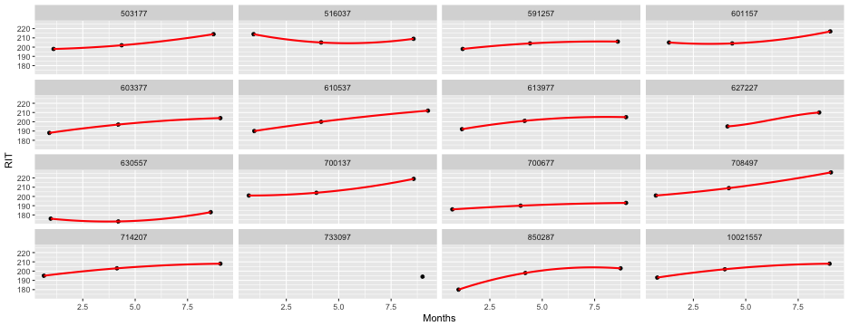

----
## Sample 2

```r
ggplot(samp2, aes(Months, RIT)) + 
	geom_point() + geom_smooth(color = "red", span = 2, se = FALSE) +
	 facet_wrap(~SID)
```

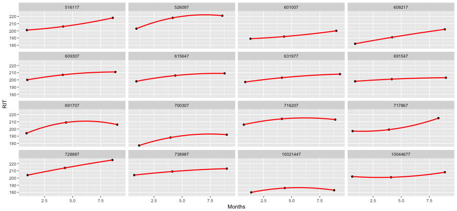

----
## Sample 3

```r
ggplot(samp3, aes(Months, RIT)) + 
	geom_point() + geom_smooth(color = "red", span = 2, se = FALSE) +
	 facet_wrap(~SID)
```

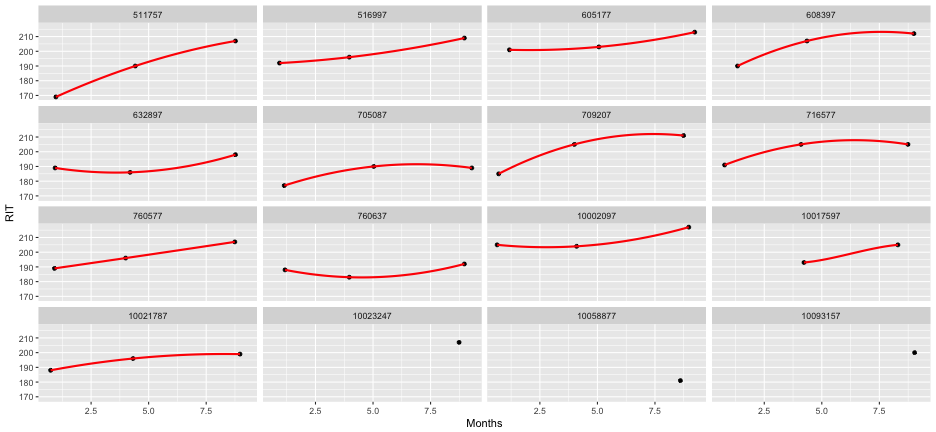

----
## Alternative: Connect the dots
Note that `group` is specified in the aesthetic now.


```r
ggplot(samp1, aes(Months, RIT, group = SID)) + geom_point() + 
	geom_line()
```


----
Or, put all lines in a single plot


```r
ggplot(samp1, aes(Months, RIT, group = SID)) + geom_point() + 
	geom_smooth(se = FALSE, span = 2)
```

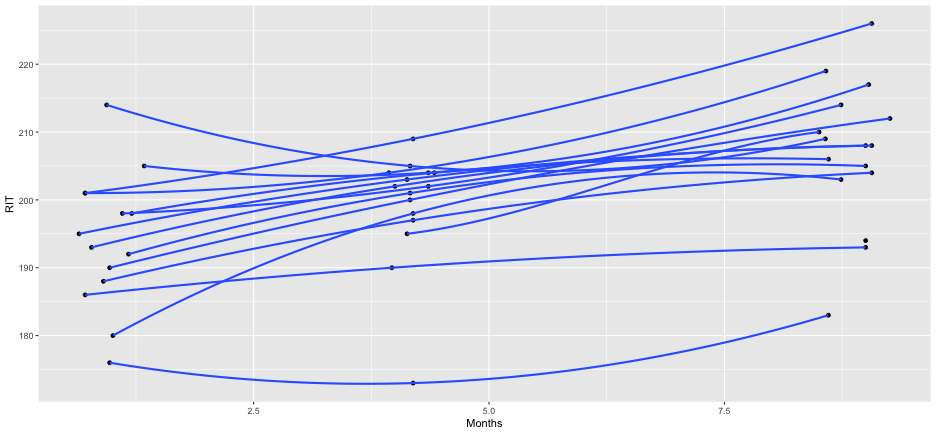

----
## What happens if you forget to specify the group?


```r
ggplot(samp1, aes(Months, RIT)) + geom_point() + 
	geom_line()
```


----
## How bad is the nonlinearity, really?
Overlay a linear trend


```r
ggplot(samp1, aes(Months, RIT)) + 
	geom_point() + geom_smooth(color = "red", span = 2, se = FALSE) +
	 geom_smooth(method = "lm", se = FALSE) + facet_wrap(~SID)
```


----

```r
ggplot(samp2, aes(Months, RIT)) + 
	geom_point() + geom_smooth(color = "red", span = 2, se = FALSE) +
	 geom_smooth(method = "lm", se = FALSE) + facet_wrap(~SID)
```

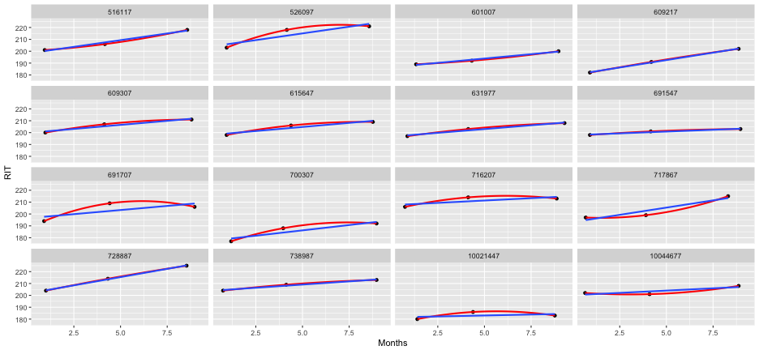

----

```r
ggplot(samp3, aes(Months, RIT)) + 
	geom_point() + geom_smooth(color = "red", span = 2, se = FALSE) +
	 geom_smooth(method = "lm", se = FALSE) + facet_wrap(~SID)
```

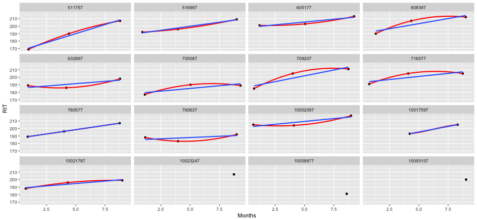

----
## A few notes
* Equivalent plots could be produced at other levels (in this case, the classroom or school levels)
* The previous plots did produce some warnings (only 3 points with the LOESS)


```r
lfit <- loess(RIT ~ Months, data = samp1, subset = SID == 503177, span = 2)
```

```
## Warning in simpleLoess(y, x, w, span, degree = degree, parametric =
## parametric, : span too small. fewer data values than degrees of freedom.
```

```
## Warning in simpleLoess(y, x, w, span, degree = degree, parametric =
## parametric, : Chernobyl! trL>n 3

## Warning in simpleLoess(y, x, w, span, degree = degree, parametric =
## parametric, : Chernobyl! trL>n 3
```

```
## Warning in sqrt(sum.squares/one.delta): NaNs produced
```

----
## Different faceting
`facet_wrap` vs `facet_grid`


----
## Options for `facet_wrap`
Change the number of columns


```r
f <- ggplot(mpg, aes(displ, hwy)) + geom_point()
f + facet_wrap(~class, ncol = 4)
```

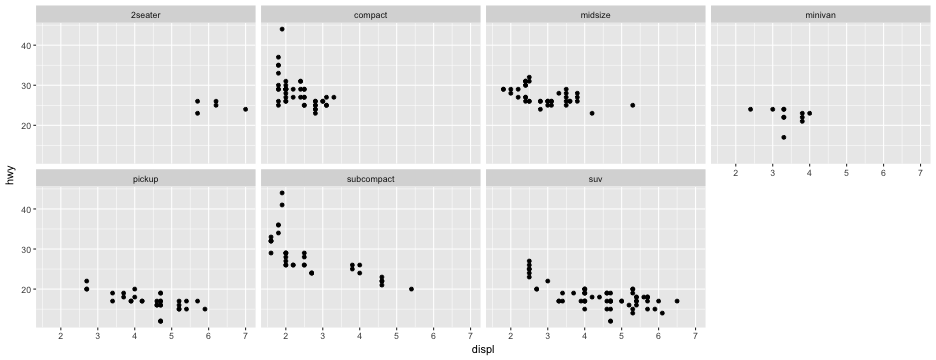

----
Change the direction plots are produced


```r
f + facet_wrap(~class, ncol = 4, dir = "v")
```


----
## Facet Grid
Note that `.` must be included on the left, if only a single variable is used


```r
f + facet_grid(. ~ cyl)
```


----

```r
f + facet_grid(drv ~ .)
```

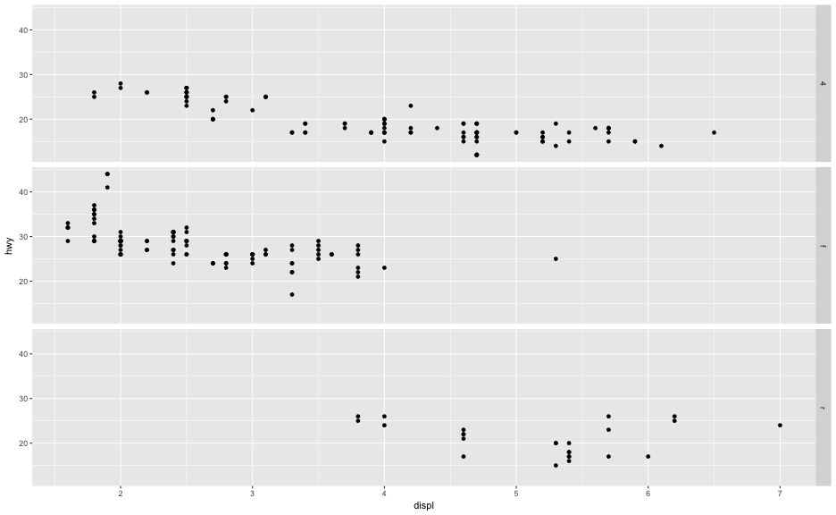

----
## Two variables


```r
f + facet_grid(drv ~ cyl)
```

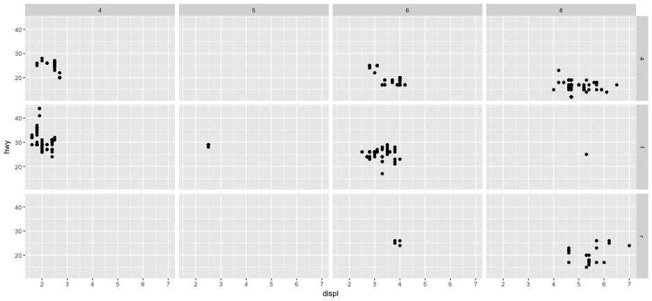

----
## Two variables

(The LOESS estimator spits out warnings here again)


```r
f + geom_smooth(span = 2) + facet_grid(drv ~ cyl)
```


-----
## Scales with faceting
Allow all scales to be produced independently (freely)


```r
f + facet_wrap(~ cyl, scales = "free")
```


----
Free y-axis scale, fixed x


```r
f + facet_wrap(~ cyl, scales = "free_y")
```


----
Free x-axis scale, fixed y


```r
f + facet_wrap(~ cyl, scales = "free_x")
```


----
Change spacing with `facet_grid`


```r
f + facet_grid(drv ~ cyl, scales = "free", space = "free")
```


---- &twocol
## Faceting vs Grouping

*** =left


```r
ggplot(mpg, 
	aes(displ, hwy, color = factor(drv))) + 
	geom_point()
```

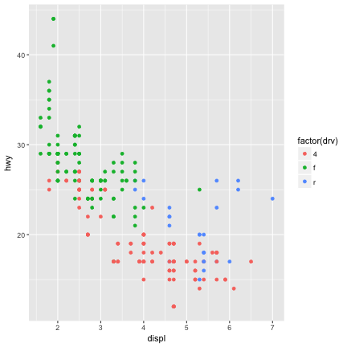

*** =right


```r
ggplot(mpg, aes(displ, hwy)) + 
	geom_point() + 
	facet_wrap(~ drv)
```


----
## Guided practice

You can view the probability densities of diamond price by cut with the following code.


```r
base <- ggplot(diamonds, aes(price, color = cut))
base + geom_density()
```

* Use faceting to view the densities by *clarity*.
* Modify the code to group by *clarity* and facet by *cut*. Which do you 
  prefer?

You can view the relation between *price* and *carat* with the following code


```r
ggplot(diamonds, aes(carat, price)) + geom_point()
```
* Modify the code so the points are colored according to their color.
* Use faceting to produce separate plots for each color.

----
Use faceting to view the densities by *clarity*.


```r
base <- ggplot(diamonds, aes(price, color = cut))
base + geom_density() + facet_wrap(~ clarity)
```


----
Modify the code to group by *clarity* and facet by *cut*.


```r
base2 <- ggplot(diamonds, aes(price, color = clarity))
base2 + geom_density() + facet_wrap(~ cut)
```

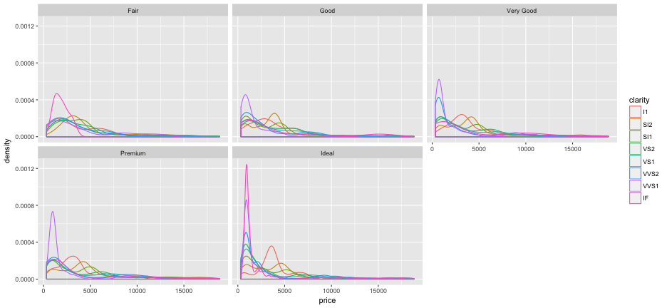

----
Modify the code so the points are colored according to their color.


```r
ggplot(diamonds, aes(carat, price, color = color)) + geom_point()
```

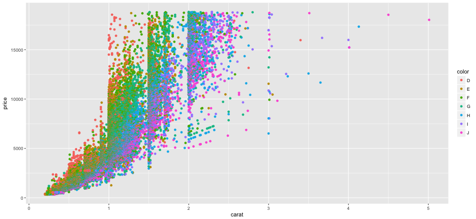

----
Use faceting to produce separate plots for each color.


```r
ggplot(diamonds, aes(carat, price)) + geom_point() + facet_wrap(~ color)
```

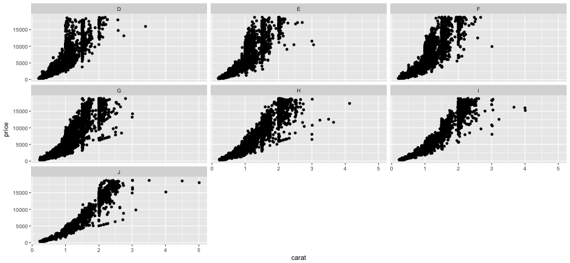

---- .segue
# Themes

----
## Overview of themes
* Themes do not change how the data are rendered
* Only change visual properties
* Many built-in themes
	+ Even more available through extension packages (specifically *ggthemes*)
* Fully customizable (though the syntax becomes lengthier)

----
## theme_gray (default)


```r
baseP <- ggplot(economics, aes(date, unemploy)) + geom_line()
baseP + theme_gray()
```


----
## theme_bw


```r
baseP + theme_bw()
```

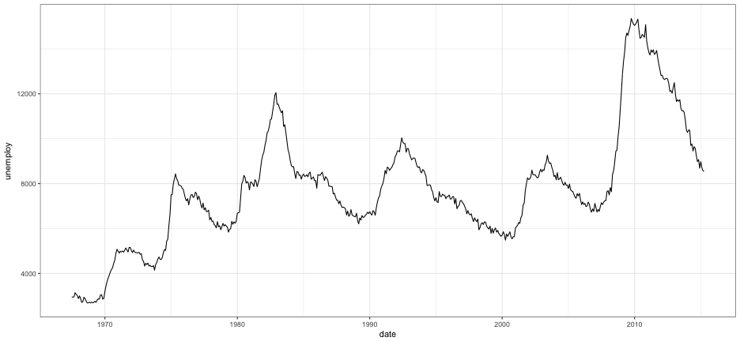

----
## theme_classic


```r
baseP + theme_classic()
```


----
## theme_dark


```r
baseP + theme_dark()
```

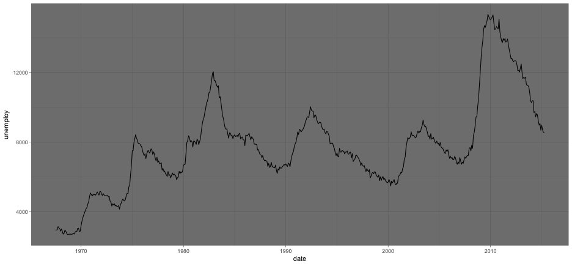

----
## theme_minimal


```r
baseP + theme_minimal()
```


----
## Further customization
* See http://docs.ggplot2.org/dev/vignettes/themes.html
* See *ggplot2* book, Chapter 8

<br>
**Take Home Message:** If you want it to look a certain way, you can do it (essentially nothing is impossible). Often there are others who have developed themes that will be close to what you want, which is easier than developing your own theme (although that can be rewarding in its own right).

--- .segue
# Exploratory versus model-based plotting

----
## Underlying theory
* *ggplot2* is optimized for speed in exploratory plotting.
* Make ugly plots when exploring, but take the time to beautify them for publication
* Model-based plotting is essentially confirmatory, but can help you understand and communicate the results better.

----
## Load and tidy SEDA Data


```r
library(tidyverse)
d <- read_csv("./course_materials/data/district means national-referenced by year grade subject (long file).csv")
td <- d %>% 
  gather(mean_link_ela:se_link_math, 
    key = "key",
    value = "score") %>% 
  separate(key, c("variable", "discard", "subject"), sep = "_") %>% 
  mutate(time = grade - 3,
  		 leaname = as.factor(leaname),
  		 stateabb = as.factor(stateabb)) %>% 
  spread(variable, score) %>% 
  select(-discard)
kable(head(td))
```


|  leaid|leaname                | fips|stateabb | year| grade|subject | time|     mean|       se|
|------:|:----------------------|----:|:--------|----:|-----:|:-------|----:|--------:|--------:|
| 100002|ALABAMA YOUTH SERVICES |    1|AL       | 2009|     8|ela     |    5| 210.5474| 6.723581|
| 100002|ALABAMA YOUTH SERVICES |    1|AL       | 2011|     8|ela     |    5| 231.6601| 6.741922|
| 100002|ALABAMA YOUTH SERVICES |    1|AL       | 2012|     8|ela     |    5| 226.1813| 6.657756|
| 100005|ALBERTVILLE CITY       |    1|AL       | 2009|     3|ela     |    0| 204.4659| 2.747565|
| 100005|ALBERTVILLE CITY       |    1|AL       | 2009|     4|ela     |    1| 207.4045| 2.939638|
| 100005|ALBERTVILLE CITY       |    1|AL       | 2009|     5|ela     |    2| 216.8594| 2.599224|

----
## `lm`-based plot

If we fit a model like `lm(mean ~ time, data = td)`, then we can actually visualize this without even fitting the model, using `ggplot`


```r
ggplot(td, aes(time, mean)) + geom_point() + geom_smooth(method = "lm")
```

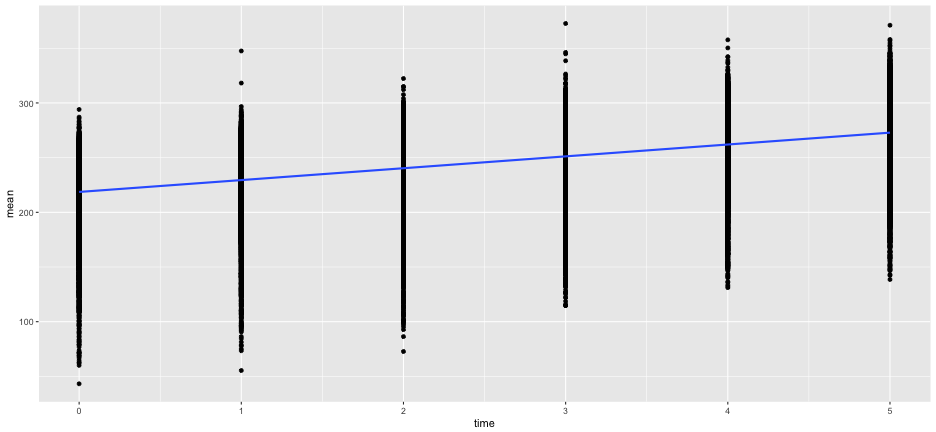

---- &twocol
## `lm`-based plot (continued)

Or perhaps we're interested in separate slopes for reading and math.

*** =left


```r
ggplot(td, aes(time, mean, color = factor(subject))) + 
	geom_point() + 
	geom_smooth(method = "lm")
```


*** =right


```r
ggplot(td, aes(time, mean)) + 
	geom_point() + 
	geom_smooth(method = "lm") +
	facet_wrap(~subject)
```

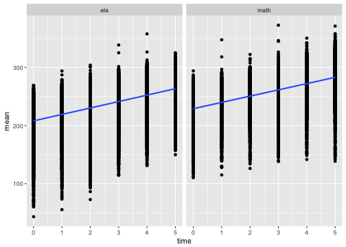

----
## Model-output plotting
While the previous plots are basically model-based plots, they can also be  exploratory, and often we want to plot results from the model. As mentioned last time, the *broom* package can help.


```r
m <- lm(mean ~ stateabb, data = td)
library(broom)
tidy_m <- tidy(m, conf.int = TRUE)

ggplot(tidy_m[-1, ], aes(estimate, term, color = term)) + # drop intercept
	geom_point() +
  	geom_errorbarh(aes(xmin = conf.low, xmax = conf.high)) +
    geom_vline(xintercept = 0)
```

----


---- .segue
# Fitting and visualizing multiple models (advanced)

----
## Fitting and plotting multiple models 
(advanced: illustration only)
* Fit separate models for each state, using `time` to predict `mean`.
* Summarize and plot $R^2$ for each model


```r
library(purrr)
by_state <- td %>% 
	group_by(stateabb) %>% 
	nest()
by_state
```

```
## # A tibble: 52 × 2
##    stateabb                  data
##      <fctr>                <list>
## 1        AL  <tibble [7,956 × 9]>
## 2        AK  <tibble [2,122 × 9]>
## 3        AZ  <tibble [8,768 × 9]>
## 4        AR <tibble [15,350 × 9]>
## 5        CA <tibble [43,806 × 9]>
## 6        CO  <tibble [7,372 × 9]>
## 7        CT  <tibble [9,076 × 9]>
## 8        DE    <tibble [938 × 9]>
## 9        DC     <tibble [60 × 9]>
## 10       FL  <tibble [4,322 × 9]>
## # ... with 42 more rows
```

----
## Fit multiple models


```r
by_state <- by_state %>% 
	mutate(model = map(data, ~lm(mean ~ time, data = .)))
by_state
```

```
## # A tibble: 52 × 3
##    stateabb                  data    model
##      <fctr>                <list>   <list>
## 1        AL  <tibble [7,956 × 9]> <S3: lm>
## 2        AK  <tibble [2,122 × 9]> <S3: lm>
## 3        AZ  <tibble [8,768 × 9]> <S3: lm>
## 4        AR <tibble [15,350 × 9]> <S3: lm>
## 5        CA <tibble [43,806 × 9]> <S3: lm>
## 6        CO  <tibble [7,372 × 9]> <S3: lm>
## 7        CT  <tibble [9,076 × 9]> <S3: lm>
## 8        DE    <tibble [938 × 9]> <S3: lm>
## 9        DC     <tibble [60 × 9]> <S3: lm>
## 10       FL  <tibble [4,322 × 9]> <S3: lm>
## # ... with 42 more rows
```

----

```r
by_state <- by_state %>% 
	mutate(r2 = map(model, summary) %>% 
				map_dbl("r.squared"))
by_state
```

```
## # A tibble: 52 × 4
##    stateabb                  data    model        r2
##      <fctr>                <list>   <list>     <dbl>
## 1        AL  <tibble [7,956 × 9]> <S3: lm> 0.5292111
## 2        AK  <tibble [2,122 × 9]> <S3: lm> 0.4486915
## 3        AZ  <tibble [8,768 × 9]> <S3: lm> 0.5183148
## 4        AR <tibble [15,350 × 9]> <S3: lm> 0.3704695
## 5        CA <tibble [43,806 × 9]> <S3: lm> 0.3802063
## 6        CO  <tibble [7,372 × 9]> <S3: lm> 0.5869236
## 7        CT  <tibble [9,076 × 9]> <S3: lm> 0.6090015
## 8        DE    <tibble [938 × 9]> <S3: lm> 0.6587978
## 9        DC     <tibble [60 × 9]> <S3: lm> 0.7073657
## 10       FL  <tibble [4,322 × 9]> <S3: lm> 0.6107051
## # ... with 42 more rows
```

----
## Plot results


```r
ggplot(by_state, aes(stateabb, r2)) + geom_point()
```

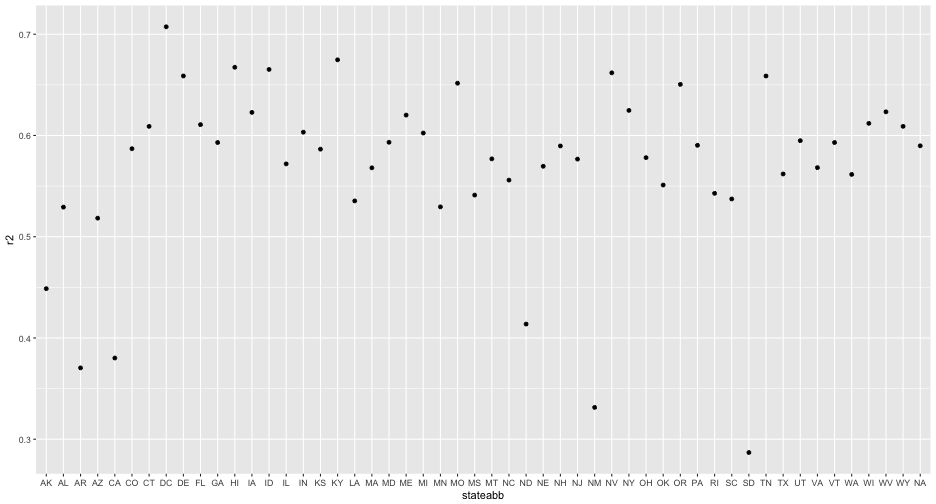
